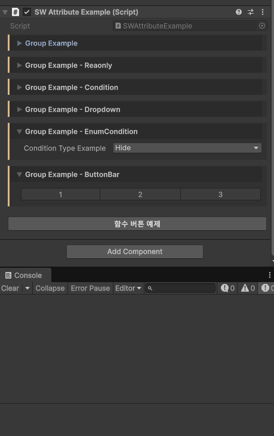
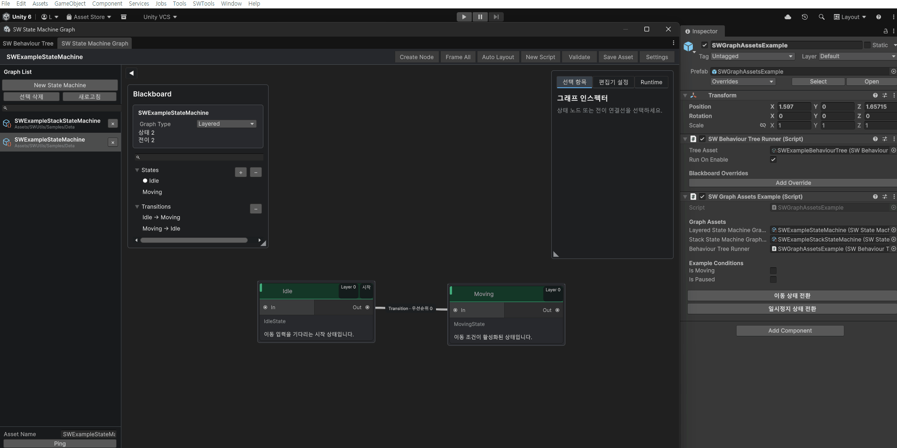
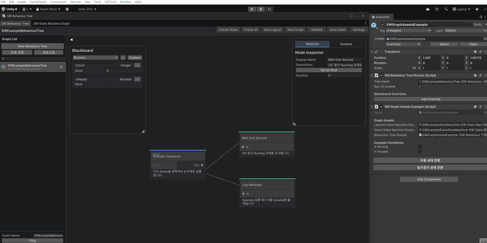
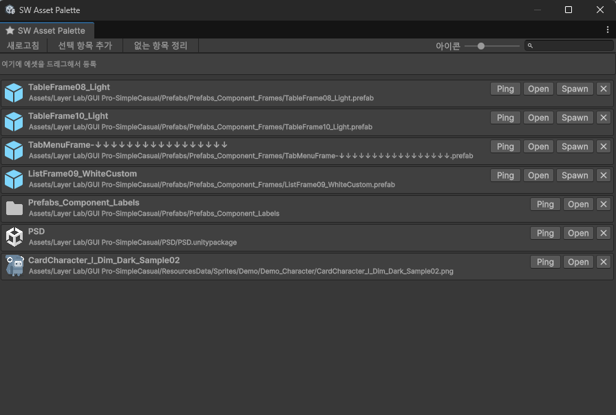
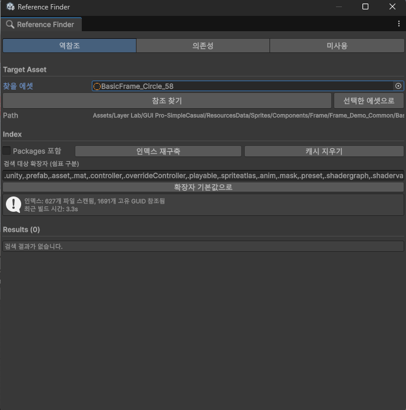
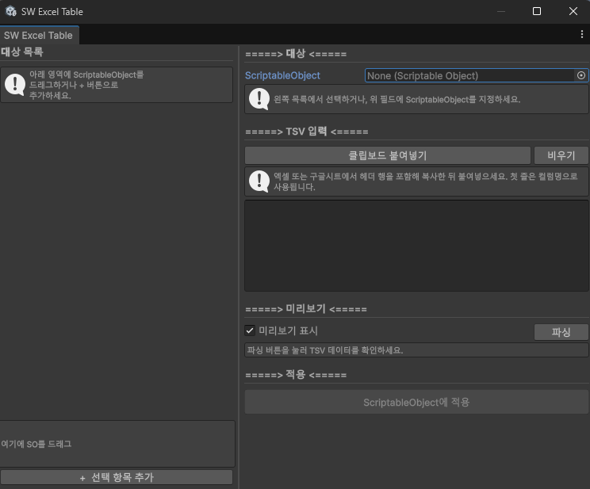
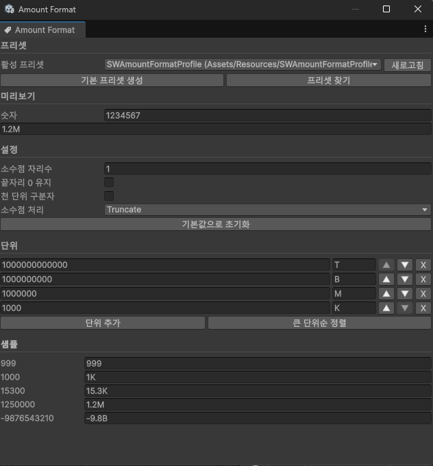

# SWUtils

[한국어](README.md) | [English](README.en.md)


SWUtils is a compact Unity utility package for runtime systems, inspector workflows, debugging tools, and editor productivity windows.

> [!WARNING]
> The features provided by SWUtils are currently experimental. Unexpected behavior or bugs may occur, so verify them thoroughly before using them in a production project.

## Overview

| Area | What it provides |
| --- | --- |
| Runtime foundations | `SWMonoBehaviour`, `SWScriptableObject`, coroutine runners, quests and achievements, pooling, popup flow, resolution helpers, stat data, and reusable utilities. |
| Graph runtimes | Layered and stack State Machines, Behaviour Trees, Blackboards, graph-asset factories, and Runtime Debug. |
| Data and persistence | Encrypted PlayerPrefs, save slots, file saves, cloud-save entry points, and JSON import/export helpers. |
| Inspector tooling | Grouped fields, buttons, conditions, dropdowns, read-only fields, `SerializeReference` type selection, and table import attributes. |
| Debugging | Runtime debug console, command registration, watch values, optional Input System support, and a lightweight performance overlay. |
| Editor workflow | Shader Graph-inspired graph editors, Graph Lists, custom node categories, debug windows, PlayerPrefs inspection, pool and event monitoring, table importing, and reference search. |

Quick links:

- [Feature Preview](#feature-preview)
- [Install from a Git URL](#install-from-a-git-url)
- [Quick Start](#quick-start)
- [Namespace Layout](#namespace-layout)
- [Runtime Features](#runtime-features)
- [Editor Features](#editor-features)
- [Assembly Definitions](#assembly-definitions)

## Feature Preview

### Inspector Attributes

Use groups, read-only fields, conditional fields, dropdowns, and method buttons directly in the standard Inspector.

<p align="center">
  
</p>

### State Machine Graph

Build states and transitions visually, then inspect the active state and latest transition while running.



### Behaviour Tree

Build trees with a Blackboard and node Inspector, then inspect node states while the tree is running.



### Editor Workflow Tools

<table>
  <tr>
    <td width="50%" valign="top">
      <strong>Quick Asset Palette</strong><br>
      Register frequently used assets and folders for fast opening, selection, and prefab creation.<br><br>
      
    </td>
    <td width="50%" valign="top">
      <strong>Reference Finder</strong><br>
      Search reverse references, dependencies, and potentially unused assets.<br><br>
      
    </td>
  </tr>
  <tr>
    <td width="50%" valign="top">
      <strong>Excel Table Importer</strong><br>
      Preview tab-separated table data and apply it to a ScriptableObject.<br><br>
      
    </td>
    <td width="50%" valign="top">
      <strong>Amount Format</strong><br>
      Manage large-number units, decimal places, and rounding behavior with reusable presets.<br><br>
      
    </td>
  </tr>
</table>

## Install from a Git URL

Add the package through Unity Package Manager:

1. Open `Window > Package Manager` from the Unity menu.
2. Select the `+` button in the upper-left corner.
3. Select `Add package from git URL...`.
4. Enter the Git URL for this repository.

Append `#branch-name` or `#tag-name` to the URL to install a specific branch or tag.

```text
https://github.com/LAVINSE/SWUtils.git#v1.2.1
```

## Dependencies

The Unity packages and modules used by SWUtils are connected automatically through `package.json` when SWUtils is installed from a Git URL.

- Localization
- TextMeshPro
- Unity UI
- Physics
- Physics 2D

Unity Input System is not installed automatically. The debug console can use it when it already exists in the project, but SWUtils keeps it optional to avoid a mandatory package dependency.

Install the following external libraries only when using their related features:

- Google Play Games: Used for Android cloud saves.
- Steamworks.NET: Used for standalone cloud saves.

## Optional Define Symbols

Add the following define symbols when using external libraries for cloud saves:

- `SW_GOOGLEPLAY_ENABLE`: Enables Google Play Games saves on Android.
- `SW_STEAMWORKS_NET`: Enables Steamworks.NET saves on standalone platforms.

## Quick Start

After installation:

1. Find the examples in `Packages > SWUtils > Samples` in the Project window.
2. Add `using SW.Base;` for `SWMonoBehaviour` and `SWScriptableObject`, and add `using SW.Attributes;` for Inspector attributes.
3. Import the namespace that owns the feature you use, such as `SW.Data`, `SW.Popup`, `SW.ScreenResolution`, or `SW.Util`.
4. Add `using SW.Coroutines;` when using `ICoroutineRunner` or `SWCoroutineRunner`.
5. If your project uses assembly definition files, add references to `SWUtils.Runtime` and any optional assemblies required by the feature.

Most manager components are scene-owned. Add the required manager or registry to a bootstrap scene and keep that scene alive when the feature must persist between scene changes.

## Namespace Layout

Runtime and Editor code use feature-oriented namespaces that match their folders:

| Folder | Namespace |
| --- | --- |
| `Runtime/Attribute` | `SW.Attributes` |
| `Runtime/Base` | `SW.Base` |
| `Runtime/Coroutine` | `SW.Coroutines` |
| `Runtime/Data` | `SW.Data` |
| `Runtime/Debug` | `SW.Debugging` |
| `Runtime/Pooling` | `SW.Pooling` |
| `Runtime/Popup` | `SW.Popup` |
| `Runtime/Quest` | `SW.Quest` |
| `Runtime/Resolution` | `SW.ScreenResolution` |
| `Runtime/Stat` | `SW.Stat` |
| `Runtime/StateMachine` | `SW.StateMachine` |
| `Runtime/Util` | `SW.Util` |
| `Editor/Attribute` | `SW.EditorTools.Attributes` |
| `Editor/<Feature>` | `SW.EditorTools.<Feature>` |

## Runtime Features

### `Runtime/Attribute`

Attributes that extend Inspector presentation and behavior.

- `SWButton`: Runs a method from an Inspector button.
- `SWButtonBar`: Displays multiple methods as a group of buttons.
- `SWCondition`: Shows or hides a field based on a Boolean field.
- `SWEnumCondition`: Shows or hides a field based on an enumeration value.
- `SWDropdown`: Displays a predefined list of values as a dropdown.
- `SWGroup`: Groups Inspector fields.
- `SWReadOnly`: Displays a field as read-only.
- `SWSubClassSelector`: Selects an implementation of an abstract class or interface from a searchable dropdown on a `SerializeReference` field.
- `SWAddTypeMenu`: Defines the type menu path shown in the `SWSubClassSelector` dropdown.
- `SWHideInTypeMenu`: Hides a type from the `SWSubClassSelector` dropdown.
- `SWRequiresConstantRepaint`, `SWRequiresConstantRepaintOnlyWhenPlaying`: Define custom Inspector repaint conditions.
- `SWTable`, `SWTableSheet`: Connect tabular data to ScriptableObject fields.

Example:

```csharp
using SW.Attributes;
using SW.Base;
using UnityEngine;

public class ExampleComponent : SWMonoBehaviour
{
    [SWGroup("Status")]
    [SWReadOnly]
    [SerializeField] private int currentLevel;

    [SerializeField] private bool useOption;

    [SWCondition("useOption", true)]
    [SerializeField] private int optionValue;

    [SWButton("Refresh Value")]
    private void RefreshValue()
    {
        currentLevel++;
    }
}
```

`SWSubClassSelector` example:

```csharp
using System;
using System.Collections.Generic;
using SW.Attributes;
using SW.Base;
using UnityEngine;

public class SubClassSelectorExample : SWMonoBehaviour
{
    [SerializeReference]
    [SWSubClassSelector]
    [SerializeField] private SkillAction skillAction;

    [SerializeReference]
    [SWSubClassSelector]
    [SerializeField] private List<SkillAction> skillActions = new List<SkillAction>();
}

[Serializable]
public abstract class SkillAction
{
    public abstract void Execute();
}

[Serializable]
[SWAddTypeMenu("Skill/Heal")]
public class HealSkillAction : SkillAction
{
    [SerializeField] private int healAmount = 10;

    public override void Execute()
    {
    }
}

[Serializable]
[SWHideInTypeMenu]
public class HiddenSkillAction : SkillAction
{
    public override void Execute()
    {
    }
}
```

When an abstract class or interface such as `SkillAction` is used as the base type, serializable implementations such as `HealSkillAction` appear in an Inspector dropdown. Use `SWAddTypeMenu` to define a menu path and `SWHideInTypeMenu` to exclude a type.

### `Runtime/Coroutine`

Separates coroutine execution behind an interface so runtime code does not depend tightly on a specific MonoBehaviour.

- `ICoroutineRunner`: Defines operations for coroutines, delayed actions, and simple interpolation.
- `SWCoroutineRunner`: Executes the coroutines.

Example:

```csharp
using System.Collections;
using SW.Coroutines;
using UnityEngine;

public class CoroutineExample : MonoBehaviour
{
    [SerializeField] private SWCoroutineRunner coroutineRunner;

    private void Start()
    {
        coroutineRunner.Run(DelayLog());
    }

    private IEnumerator DelayLog()
    {
        yield return new WaitForSeconds(1f);
        Debug.Log("Complete");
    }
}
```

`SWCoroutineRunner` also provides cached wait instructions and common scheduling operations:

```csharp
coroutineRunner.DelayedCall(1f, () => Debug.Log("One second later"));
coroutineRunner.NextFrame(() => Debug.Log("Next frame"));
coroutineRunner.Repeat(0.5f, 3, index => Debug.Log($"Repeat {index}"));
coroutineRunner.Tween(
    0.25f,
    progress => transform.localScale = Vector3.one * progress,
    () => Debug.Log("Tween complete"),
    true);
```

Keep the returned `Coroutine` when an individual operation may need to be cancelled with `Stop`.

### `Runtime/Data`

Provides save data, PlayerPrefs, encryption, and cloud save features.

- `SWPlayerPrefs`: A PlayerPrefs wrapper with slot selection, encryption, and JSON import and export.
- `SWPlayerPrefsSettings`: A settings asset that stores project-specific salt and initialization-vector salt values.
- `SWSaveDataManager`: Saves and loads multiple data types in a file.
- `SWCloud`: A unified entry point for Google Play Games, iCloud, Steamworks.NET, and local fallback saves.
- `SWEncrypt<T>`: Stores `int`, `long`, `float`, `double`, `bool`, and `string` values as encrypted PlayerPrefs data.
- `SWSaveSlot`: Provides default save-slot constants.

Example:

```csharp
using SW.Data;
using SW.Popup;
using SW.ScreenResolution;
using SW.Util;

SWPlayerPrefs.SetSlot("player_01");
SWPlayerPrefs.SetInt("coin", 100);
SWPlayerPrefs.Save();

int coin = SWPlayerPrefs.GetInt("coin", 0);
```

The selected slot is included in the stored key space. Select the slot before every read or write flow that can run before your bootstrap initialization.

```csharp
SWPlayerPrefs.SetSlot("player_01");

SWPlayerPrefs.SetLong("total_score", 125000L);
SWPlayerPrefs.SetDouble("play_time", 42.5d);
SWPlayerPrefs.SetBool("tutorial_complete", true);
SWPlayerPrefs.Save();

string exportedJson = SWPlayerPrefs.ExportToJson();
bool imported = SWPlayerPrefs.ImportFromJson(exportedJson);
```

`ImportFromJson` replaces the imported keys, while `MergeFromJson` merges incoming entries into the current slot. Use `HasKey`, `DeleteKey`, and `DeleteAll` for key-level or slot-level cleanup.

Create and edit salt settings from `SWTools/Utils/Project/PlayerPrefs Salt Settings`. The settings asset is created at `Assets/Resources/SWPlayerPrefsSettings.asset` and loaded automatically through Resources at runtime. Data saved with a previous salt cannot be read after the salt changes, so delete or migrate existing data first.

Save manager example:

```csharp
using System;
using SW.Data;
using SW.Popup;
using SW.ScreenResolution;
using SW.Util;

[Serializable]
public class PlayerSaveData
{
    public int level;
    public int coin;
}

SWSaveDataManager.SetData(new PlayerSaveData { level = 3, coin = 100 });
SWSaveDataManager.SaveAll();

SWSaveDataManager.LoadAll();
PlayerSaveData data = SWSaveDataManager.GetData<PlayerSaveData>();
```

Use `TryGetData` when a save may not exist, and use the asynchronous methods when cloud synchronization is enabled:

```csharp
SWSaveDataManager.SetSlot("player_01");

if (SWSaveDataManager.HasSave())
{
    await SWSaveDataManager.LoadAllAsync();

    if (SWSaveDataManager.TryGetData(out PlayerSaveData loadedData))
        Debug.Log($"Loaded level: {loadedData.level}");
}

await SWSaveDataManager.SaveAllAsync();
```

`ListSaves`, `CopySlot`, `Delete`, and `GetSaveInfo` provide save-slot management. `SaveAll` writes the registered data and the current SWUtils PlayerPrefs slot together; changing the save-manager slot also aligns the PlayerPrefs slot.

### `Runtime/Debug`

Provides a runtime debug console, command registration, watch values, logging helpers, and a lightweight performance overlay.

- `SWDebugConsole`: Shows runtime logs, executes registered commands, manages watch values, and draws the performance overlay.
- `SWDebugConsoleSettings`: Stores console open input, optional Input System handling, and overlay display settings.
- `SWCommand`: Registers static or instance methods as console commands.
- `SWLog`: Writes logs only when `SW_DEBUG_MODE` is enabled.

Add `SW_DEBUG_MODE` from `SWTools/Debug/Console/Debug Console Settings` before using the console in a build. When the symbol is missing, console calls are compiled out through conditional methods.

Debug console setup:

1. Open `SWTools/Debug/Console/Debug Console Settings`.
2. Select `상태` and add `SW_DEBUG_MODE` for the current build target.
3. Select `입력` and create the settings asset if you want project-specific input values.
4. Choose the open key and optional `Control`, `Shift`, or `Alt` modifiers.
5. Set the mobile touch count used to open the console on touch devices.

The package no longer requires the Unity Input System package. If `Input System 확인` is enabled and the Input System package exists in the project, SWUtils checks it through cached reflection first. If the package is missing, the console falls back to Unity's built-in `Input` API without compile errors.

Performance overlay setup:

1. Open `SWTools/Debug/Console/Debug Console Settings`.
2. Select `오버레이`.
3. Enable `시작 시 표시` if the overlay should appear automatically after scene load.
4. Choose the screen corner, scale, update interval, visible metrics, and FPS warning thresholds.

Runtime control:

```csharp
using SW.Debugging;

SWDebugConsole.Show();
SWDebugConsole.ToggleOverlay();
SWDebugConsole.ResetOverlayStats();
```

Register a command:

```csharp
using SW.Attributes;

public class DebugCommands
{
    [SWCommand("give_gold", "Adds gold for testing", "Test")]
    private static void GiveGold(int amount)
    {
    }
}
```

### `Runtime/Base` - `SWMonoBehaviour`

Provides the `SWMonoBehaviour` base class for use with the attribute-driven `SWTools` custom Inspector.

Example:

```csharp
using SW.Attributes;
using SW.Base;
using UnityEngine;

public class PlayerController : SWMonoBehaviour
{
    [SerializeField] private float moveSpeed = 5f;
}
```

### `Runtime/Base` - `SWScriptableObject`

Provides the `SWScriptableObject` base class for ScriptableObject assets that use the same attribute-driven custom Inspector as `SWMonoBehaviour`.

Fields and methods can use Inspector features such as `SWGroup`, `SWButton`, `SWCondition`, `SWReadOnly`, and the constant repaint attributes.

Example:

```csharp
using SW.Attributes;
using SW.Base;
using UnityEngine;

[CreateAssetMenu(
    fileName = "CharacterData",
    menuName = "Game Data/Character Data")]
public class CharacterData : SWScriptableObject
{
    [SWGroup("Status")]
    [SerializeField] private int maxHp = 100;

    [SWGroup("Status")]
    [SWReadOnly]
    [SerializeField] private int calculatedPower;

    [SWButton("Recalculate Power")]
    private void RecalculatePower()
    {
        calculatedPower = maxHp * 2;
    }
}
```

### `Runtime/Pooling`

Provides GameObject pooling and group-based spawning.

- `SWPool`: A singleton-based object pool.
- `IPool`: Defines the pooling contract.
- `IPoolable`: Defines callbacks invoked when an object is spawned from or returned to a pool.
- `SWPoolCatalog`: A ScriptableObject containing pool registrations.
- `SWPoolRegistry`: Registers pools and groups when a scene starts.
- `SWPoolGroupSelectionMode`: Defines how an object is selected from a group.
- `SWPoolSnapshot`: A read-only pool state snapshot for `SWTools/Debug/Pool/Pool Monitor Window`.

Example:

```csharp
using SW.Pooling;
using UnityEngine;

public class SpawnExample : MonoBehaviour
{
    [SerializeField] private GameObject bulletPrefab;

    private void Start()
    {
        SWPool.Instance.Prewarm(bulletPrefab, 20);
    }

    private void Fire()
    {
        GameObject bullet = SWPool.Instance.Spawn(bulletPrefab, transform.position, transform.rotation);
        SWPool.Instance.Release(bullet, 2f);
    }
}
```

Setup:

1. Create an `SWPoolCatalog` asset and register each prefab with its prewarm count and maximum size.
2. Add `SWPool` and `SWPoolRegistry` to the bootstrap scene.
3. Assign the catalog to `SWPoolRegistry`.
4. Spawn by prefab reference or by a configured group, then return instances through `Release`.

Pool callback example:

```csharp
using SW.Pooling;
using UnityEngine;

public class Bullet : MonoBehaviour, IPoolable
{
    private IPool pool;

    public void SetPool(IPool pool)
    {
        this.pool = pool;
    }

    public void OnSpawnFromPool()
    {
        gameObject.SetActive(true);
    }

    public void OnReturnToPool()
    {
        gameObject.SetActive(false);
    }
}
```

### `Runtime/Popup`

Manages popup creation, display, hiding, caching, and animation.

- `SWPopupBase`: The base component for all popups.
- `SWPopupManager`: Handles popup display, hiding, key-based registration, and caching.
- `SWPopupCatalog`: A ScriptableObject that maps keys to popup prefabs.
- `SWPopupShowEffect`, `SWPopupHideEffect`: Abstract classes for show and hide effects.
- `SWPopupScaleShowEffect`, `SWPopupScaleHideEffect`: Default coroutine-based scale effects.
- `SWPopupLifecycle`: Connects popup lifecycle events.

Example:

```csharp
using SW.Data;
using SW.Popup;
using SW.ScreenResolution;
using SW.Util;
using UnityEngine;

public class PopupExample : MonoBehaviour
{
    [SerializeField] private SWPopupBase optionPopupPrefab;

    public void OpenOption()
    {
        SWPopupManager.Instance.Show(optionPopupPrefab);
    }
}
```

Setup:

1. Add `SWPopupManager` to the bootstrap scene.
2. Create popup prefabs derived from `SWPopupBase`.
3. Assign optional show and hide effect assets on each popup.
4. Use prefab-based calls directly, or create an `SWPopupCatalog` and register string keys for key-based calls.

Key-based example:

```csharp
using SW.Data;
using SW.Popup;
using SW.ScreenResolution;
using SW.Util;

SWPopupManager.Instance.Register("option", optionPopupPrefab);
SWPopupManager.Instance.Show("option");
SWPopupManager.Instance.Hide("option");
```

### `Runtime/Resolution`

Provides resolution, safe area, and CanvasScaler adjustments.

- `SWSafeArea`: Automatically adjusts RectTransform anchors for notches, Dynamic Islands, and punch-hole areas.
- `SWCanvasResolution`: Adjusts CanvasScaler `matchWidthOrHeight` according to the screen aspect ratio.

Usage:

1. Add `SWSafeArea` to the user interface object that requires safe-area handling.
2. Add `SWCanvasResolution` to a Canvas that requires CanvasScaler adjustment.
3. Configure the directions and ratios in the Inspector.

### `Runtime/Quest`

Provides a data-driven quest and achievement runtime built on `SWIdentifiedObject`, `SWSingleton`, encrypted `SWPlayerPrefs`, and `SWEventBus`.

> [!WARNING]
> The quest and achievement system is experimental. Its complete design review and real-project validation are not finished, so its save-data format and public API may change. Validate it thoroughly before using it in production.

- `SWQuest` combines sequential task groups, acceptance and cancellation conditions, and rewards.
- `SWAchievement` is always saved, cannot be canceled, and completes automatically.
- `SWQuestTask` filters reports by `SWCategory` and optional string or Unity object targets.
- `SWQuestTaskAction` provides replace, additive, positive-only, negative-only, and continuous progress strategies. A task with no action uses additive progress.
- `SWQuestCondition` and `SWQuestReward` are extension points for project rules and reward services.
- `SWQuestDatabase` and `SWAchievementDatabase` separately store, query, collect, and validate quest and achievement definitions.
- `SWQuestSystem` owns isolated runtime clones, duplicate prevention, reports, completion, cancellation, automatic achievement registration, and save restoration.
- `SWQuestSystemWindow` creates, duplicates, deletes, searches, and edits related assets, and synchronizes and validates both databases.
- `ISWQuestSaveStore` allows projects to replace persistence; the default implementation uses encrypted `SWPlayerPrefs`.
- `SWQuestGiver` and `SWQuestReporter` connect scene interactions to the runtime without coupling presentation code to quest internals.

Open `SWTools > Utils > Data > Quest System Editor` to create and manage the related assets. Create a quest database and an achievement database, synchronize each one with the project definitions, validate them, and assign both to a bootstrap-scene `SWQuestSystem`. Give every task group a code name that is unique within its quest, then report gameplay progress:

```csharp
using SW.Quest;

SWQuestSystem questSystem = SWQuestSystem.Instance;
questSystem.Initialize(questDatabase, achievementDatabase);
SWQuest runtimeQuest = questSystem.Register(questDefinition);
questSystem.ReceiveReport(killCategory, slimeTarget.Value, 1);

if (runtimeQuest != null && runtimeQuest.IsWaitingForCompletion)
{
    runtimeQuest.Complete();
}
```

`Save()` and `Load()` use encrypted `SWPlayerPrefs`. Disable automatic loading and call `SetSaveStore(ISWQuestSaveStore)` before initialization to use another store. To include quest state in a larger save root, store the `SWQuestSystemSaveData` returned by `CreateSaveData()` and pass it back to `RestoreSaveData()`. Task groups and tasks restore by code name, so their ordering may change without assigning progress to the wrong definition. Restoring completed entries never grants their rewards again. Project conditions and rewards can receive external services through `SetContext` and `TryGetContext<TContext>`. See `Samples/Scripts/SWQuestExample.cs` and `SWQuestScoreRewardExample.cs`.

### `Runtime/StateMachine`

Provides a general-purpose finite state machine that supports independent layers without depending on a Unity component.

- `SWStateMachine<TContext>`: Owns states, transitions, layers, commands, and messages.
- `SWState<TContext>`: Defines initialization, enter, tick, exit, and message callbacks.
- `SWMonoStateMachine<TContext>`: Drives a state machine from regular, physics, or manual Unity updates.
- `SWStackStateMachine<TContext>`: Pushes and removes states while preserving the states below them.
- `SWStackState<TContext>`: Defines enter, pause, resume, tick, exit, and message callbacks for stack states.
- `SWMonoStackStateMachine<TContext>`: Drives a stack state machine from the Unity update lifecycle.

Each layer owns one current state and runs independently in ascending layer order. Any-state transitions are evaluated before transitions from the current state. Within the same priority, transitions use registration order.

```csharp
using SW.StateMachine;

SWStateMachine<Player> stateMachine = new SWStateMachine<Player>(player);
stateMachine.AddState<IdleState>(0);
stateMachine.AddState<MovingState>(0);
stateMachine.SetInitialState<IdleState>(0);

stateMachine.AddTransition<IdleState, MovingState>(
    state => state.Context.IsMoving,
    0);
stateMachine.AddAnyTransition<IdleState>(PlayerStateCommand.ReturnToIdle, layer: 0);

stateMachine.Start();
stateMachine.Tick(deltaTime);
```

See `Samples/Example/SWGraphAssetsExample.cs` for the consolidated graph-based layered state example.

Only the top stack state receives ticks. Pushing a state pauses the previous top state, and popping it resumes the state below without re-entering it.

```csharp
SWStackStateMachine<GameFlow> stackStateMachine =
    new SWStackStateMachine<GameFlow>(gameFlow);

stackStateMachine.AddState<GameplayState>();
stackStateMachine.AddState<PauseState>();
stackStateMachine.AddState<SettingsState>();
stackStateMachine.Start<GameplayState>();

stackStateMachine.Push<PauseState>();
stackStateMachine.Push<SettingsState>();
stackStateMachine.Pop();
```

The same `SWGraphAssetsExample` file also contains graph-compatible stack states and runtime control.

#### State Machine Graph Editor

The Unity 6-only graph editor stores state nodes and connections in a `ScriptableObject` asset. Its Shader Graph-inspired layout uses a full-window canvas with a collapsible Graph List, floating Blackboard and Graph Inspector panels, and a bottom validation console.

1. Create an asset from `Assets > Create > SWTools > State Machine Graph`.
2. Double-click the asset or select `Edit State Machine Graph` in its Inspector.
3. You can also open `SWTools > Utils > State Machine > Graph Editor`.
4. Choose `Layered` or `Stack` from `Graph Type` in the Blackboard.
5. Right-click empty canvas space and choose `Create Node...`. The toolbar action and `Space` key open the same searchable finder.
6. Select an implementation of `SWState<TContext>` or `SWStackState<TContext>` from States. Flow Control contains Any State and Return nodes. Nodes are created at the graph position where the finder was opened.
7. Drag from a node's `Out` connector to another node's `In` connector. The edge badge shows its operation, command, and priority directly on the canvas.
8. Select a node to edit its name, initial-state flag, and layer. Select an edge to edit its operation, command, condition, reentry, and priority.
9. Press `Delete` to remove selected elements. The searchable States and Transitions lists in the Blackboard support selection, creation, deletion, and independent folding.
10. Check the bottom status bar or select `Validate`, then save the asset.

Keyboard shortcuts are `Ctrl+C` to copy, `Ctrl+V` to paste, `Ctrl+D` to duplicate, `A` to frame all, `O` to frame the origin, and `Space` to open node search. Connections and transition settings between copied nodes are preserved and can be pasted into another asset with the same Graph Type.

`Auto Layout` arranges nodes by layer and initial-state priority, while the canvas position and zoom are restored per graph asset. `New Script` creates Layered State, Stack State, and Transition Condition scripts from editable templates. Shared options are also available under `Project Settings > SWUtils > State Machine Graph`.

Layered graphs connect states in the same layer and support an Any State node. Stack graphs support push and replace connections, while a connection to the Return node represents popping the current state and resuming the covered state.

Regular states use green cards, Any State uses violet, and Return State uses cyan. The Graph List collapses to the left, while the Blackboard lists and focuses States and Transitions and Graph Validation expands into a console-like issue list. Blackboard and Graph Inspector can be resized independently from their lower corners. Transition summaries continue to follow their nodes; hold `Alt` and drag a summary to save a custom offset in the graph asset. Return State is an input-only Pop target in Stack graphs. The Settings tab configures transition summaries, node and panel sizes, grid snapping, and grid spacing. Editor layout preferences are saved per Unity Editor user.

State machines created by the graph factory register automatically with the Play Mode debugger. Select the context GameObject to inspect active states, active duration, and recent transition history in the Runtime tab. Active nodes display a yellow LIVE badge and the latest transition is highlighted.

Create runtime state machines directly from graph assets:

```csharp
SWStateMachine<Player> stateMachine =
    SWStateMachineGraphFactory.CreateLayered(graphAsset, player);

SWStackStateMachineGraphController<GameFlow> stackController =
    SWStateMachineGraphFactory.CreateStack(graphAsset, gameFlow);
```

Implement `SWStateMachineGraphCondition<TContext>` for a project condition and select it from `Select Condition Type` in the edge details panel.

```csharp
public sealed class IsMovingCondition : SWStateMachineGraphCondition<Player>
{
    public override bool Evaluate(Player context)
    {
        return context.IsMoving;
    }
}
```

The layered graph factory returns a configured and started `SWStateMachine<TContext>`. The stack graph controller provides `Tick`, `ExecuteCommand`, `SendMessage`, and `Stop`, and executes graph-authored push, replace, and pop connections.

### Behaviour Tree

`SWBehaviourTreeAsset` in the `SW.BehaviourTree` namespace provides a Behaviour Tree runtime based on `Running`, `Success`, `Failure`, and `Aborted`. It includes Composite, Decorator, Action, SubTree, typed Blackboard, NodeProperty, and per-Runner override support. Project-defined node and custom Blackboard entry types appear automatically in the editor.

Create an asset from `Assets > Create > SWTools > Behaviour Tree`, then open `SWTools > Utils > Behaviour > Tree Editor`. Connect a parent's `Out` port to a child's `In` port. Composite nodes accept multiple children, Decorators accept one, and Actions accept none. Children execute from left to right and are reordered automatically when moved. The floating Blackboard edits shared typed values, while Node Inspector edits descriptions and node-specific fields. Add `SWBehaviourTreeRunner` to execute an isolated runtime clone. In Play Mode, select its GameObject to see Running, Success, and Failure colors in the graph.

The graph supports copy, paste, duplicate, SubTree selection, keyboard navigation, automatic layout, quick asset switching, node script generation, per-asset view persistence, and colored runtime paths. Configure node and panel layout under `Project Settings > SWUtils > Behaviour Tree`.

Both graph editors provide a collapsible shared Graph List and Runtime Debug. Use slash-delimited attributes such as `SWStateMachineNodeCategory("Combat/Movement")` and `SWBehaviourNodeCategory("Combat/Actions")` to organize custom states, conditions, and Behaviour nodes in creation menus.

Generic Set Property and Compare Property nodes support built-in and custom Blackboard values. `SWBehaviourTreeRunner` exposes external get, set, and cached key APIs, and custom keys can be overridden per Runner. Node scripts are generated from editable text templates under `Editor/Behaviour/Templates`.

### `Runtime/Util`

A collection of small, general-purpose game utilities.

- `SWAudioLibrary`, `SWAudioManager`: Manage key-based music and sound-effect playback.
- `SWCooldown`: Calculates cooldown progress, remaining time, and availability.
- `SWEventBus`: Handles type-based event subscription, publication, and unsubscription.
- `SWEventBusEventSnapshot`: A read-only event state snapshot for `SWTools/Debug/Event/EventBus Debugger Window`.
- `SWSceneLoader`: Handles scene loading, additive loading, unloading, and reloading.
- `SWSingleton`, `SWSingletonScene`: Singleton MonoBehaviour base classes.
- `SWTimer`, `SWRefillTimer`: Provide elapsed-time and refill timer behavior.
- `SWExtension`: Extension methods for Transform, GameObject, and other types.
- `SWFactory`: Assists with runtime object creation.
- `SWLog`: A logging wrapper.
- `SWResolution`: Assists with resolution calculations.
- `SWString`: Provides string helpers such as extracting numbers.
- `SWTime`: Provides time formatting and calculation helpers.
- `SWTriggerDispatcher`: Delegates trigger events.
- `SWUtility`: Provides shared helpers such as user interface gauge updates.
- `SWVibration`: Invokes vibration on Android and iOS.
- `SWAmountFormat`: Formats large numbers with suffixes such as K, M, B, and T.
- `SWAmountFormatProfile`: Stores number suffixes, decimal places, and decimal handling in a Resources preset asset.
- `SWRectDummy`: A mesh-free Graphic that creates a rectangular user interface raycast area without an Image.

#### Audio

1. Create an audio library from `Assets > Create > SWUtils > Audio Library`.
2. Register music and sound-effect clips with unique string keys.
3. Add `SWAudioManager` to the bootstrap scene and assign the library.
4. Optionally assign dedicated music and sound-effect `AudioSource` components. Missing sources are created automatically.

```csharp
using SW.Data;
using SW.Popup;
using SW.ScreenResolution;
using SW.Util;
using UnityEngine;

public class AudioExample : MonoBehaviour
{
    public void PlayLobbyMusic()
    {
        SWAudioManager.Instance.PlayMusic("lobby", true, 0.5f);
    }

    public void PlayButtonSound()
    {
        SWAudioManager.Instance.PlaySfx("button");
    }

    public void ApplyVolume(float volume)
    {
        SWAudioManager.Instance.SetMasterVolume(volume);
        SWAudioManager.Instance.SaveVolumes();
    }
}
```

Call `LoadVolumes` during initialization if volume settings were saved previously.

Event bus example:

```csharp
using SW.Data;
using SW.Popup;
using SW.ScreenResolution;
using SW.Util;

public readonly struct CoinChangedEvent
{
    public readonly int Coin;

    public CoinChangedEvent(int coin)
    {
        Coin = coin;
    }
}

SWEventBus.Subscribe<CoinChangedEvent>(OnCoinChanged);
SWEventBus.Publish(new CoinChangedEvent(100));
SWEventBus.Publish(new CoinChangedEvent(200), false); // Suppresses the publish log.
SWEventBus.Unsubscribe<CoinChangedEvent>(OnCoinChanged);

SWEventBus.IsLogOutputEnabled = false; // Suppresses all event bus logs.
```

Cooldown example:

```csharp
using SW.Data;
using SW.Popup;
using SW.ScreenResolution;
using SW.Util;

private readonly SWCooldown skillCooldown = new(3f);

private void TryUseSkill()
{
    if (!skillCooldown.TryUse()) return;

    // Execute the skill.
}
```

Timer example:

```csharp
using SW.Data;
using SW.Popup;
using SW.ScreenResolution;
using SW.Util;
using UnityEngine;

public class RoundTimerExample : MonoBehaviour
{
    private readonly SWTimer roundTimer = new SWTimer(60f);

    private void Start()
    {
        roundTimer.Start();
    }

    private void Update()
    {
        if (roundTimer.Tick())
            Debug.Log("Round complete");
    }
}
```

`SWTimer.Tick` must be called by an update owner. Use `Pause`, `Resume`, `Restart`, and `SetDuration` to control it. `SWRefillTimer` is intended for count recovery across sessions; construct it with a stable save key, call `Use` when spending a count, and call `RecoverOffline` after loading.

Scene-loading example:

```csharp
using SW.Data;
using SW.Popup;
using SW.ScreenResolution;
using SW.Util;
using UnityEngine;

public class SceneTransitionExample : MonoBehaviour
{
    public void LoadLobby()
    {
        SWSceneLoader.Instance.LoadScene(
            "Lobby",
            onProgress: progress => Debug.Log($"Loading: {progress:P0}"),
            onComplete: () => Debug.Log("Lobby loaded"));
    }
}
```

Add all target scenes to Build Settings before loading them. `LoadAdditive`, `UnloadScene`, `ReloadActiveScene`, and `SetActiveScene` cover multi-scene flows. Set `AllowSceneActivation` when a loading screen must hold activation after loading reaches the ready state.

Number format preset example:

```csharp
using SW.Data;
using SW.Popup;
using SW.ScreenResolution;
using SW.Util;
using TMPro;
using UnityEngine;

public class GoldTextExample : MonoBehaviour
{
    [SerializeField] private SWAmountFormatProfile amountFormatProfile;
    [SerializeField] private TMP_Text goldText;

    public void SetGold(long goldAmount)
    {
        SWAmountFormatProfile profile = amountFormatProfile != null
            ? amountFormatProfile
            : SWAmountFormatProfile.LoadDefault();

        goldText.text = profile.Format(goldAmount);
    }
}
```

Create and edit the default number format preset from `SWTools/Utils/Data/Amount Format Window`. The settings asset is created at `Assets/Resources/SWAmountFormatProfile.asset` and can be loaded through Resources at runtime.

Rect Dummy usage:

1. Add `SWRectDummy` to a user interface object that only needs a clickable area.
2. Enable Raycast Target on `SWRectDummy` to use it as an input area without an Image component.
3. Use the `Fit Parent` Inspector button or context menu to match the parent RectTransform.
4. Select `GameObject > UI > SW Rect Dummy` to create one from the menu.

## Editor Features

### `Editor/Attribute`

A collection of PropertyDrawers that render the Inspector features defined in `Runtime/Attribute`.

### `Editor/Window`

Editor windows available from the `SWTools` menu. Debugging tools are under `SWTools/Debug`, while general utilities are under `SWTools/Utils`.

- `SWTools/Debug/Build/Build Report Viewer`: Inspects build reports and included asset sizes.
- `SWTools/Debug/Console/Debug Console Settings`: Configures the runtime debug console, performance overlay, debug define symbol, and play-mode controls.
- `SWTools/Debug/Event/EventBus Debugger Window`: Inspects registered `SWEventBus` event types, listener counts, publication counts, and the latest published data.
- `SWTools/Debug/Input/Input Debugger Window`: Inspects EventSystem, pointer, raycast, and input states.
- `SWTools/Debug/PlayerPrefs/PlayerPrefs Viewer`: Views, edits, and deletes SWUtils PlayerPrefs and standard Unity PlayerPrefs data in separate tabs.
- `SWTools/Debug/Pool/Pool Monitor Window`: Inspects created, active, inactive, spawned, returned, and delayed-return counts for each `SWPool` prefab.
- `SWTools/Debug/Test/Test Tools Window`: Assists with play-mode testing and scene navigation.
- `SWTools/Utils/Asset/Quick Asset Palette`: Provides quick access to frequently used assets.
- `SWTools/Utils/Asset/Reference Finder`: Finds project references to the selected asset.
- `SWTools/Utils/Asset/TMP Font Asset Manager`: Manages TextMeshPro font asset assignment and performance inspection.
- `SWTools/Utils/Data/Amount Format Window`: Creates and edits number format presets.
- `SWTools/Utils/Data/Excel Table Importer`: Applies tabular text to ScriptableObject data.
- `SWTools/Utils/Data/Localization Tools`: Assists with Localization table workflows.
- `SWTools/Utils/Data/Stat System Editor`: Creates, edits, sorts, renames, previews icons, and adjusts list display sizes for `SWIdentifiedObject` assets such as categories and stats.
- `SWTools/Utils/Hierarchy/Hierarchy Tools`: Configures Hierarchy object colors, icons, and styles.
- `SWTools/Utils/Project/Define Symbol Window`: Manages Scripting Define Symbols.
- `SWTools/Utils/Project/PlayerPrefs Salt Settings`: Creates and edits the SWPlayerPrefs encryption salt asset.
- `SWTools/Utils/Screen/Resolution Window`: Displays resolution test values.
- `SWTools/Utils/Simulation/Random Simulator`: Simulates weighted and shuffled random selection.
- `SWTools/Utils/State Machine/Graph Editor`: Creates and edits layered and stack state machine graph assets.

#### `SWTools/Debug/Console/Debug Console Settings`

Uses focused tabs to keep debug console configuration compact:

- `상태`: Connects or creates the Resources settings asset and adds or removes `SW_DEBUG_MODE` for the active build target.
- `입력`: Sets auto creation, open key, optional modifier keys, touch count, and optional Input System checking.
- `오버레이`: Sets startup visibility, anchor, scale, refresh interval, shown metrics, and FPS threshold colors.
- `플레이`: Opens, closes, toggles the overlay, and resets overlay statistics while the Editor is in play mode.

#### `SWTools/Debug/Event/EventBus Debugger Window`

Displays the current `SWEventBus` state in play mode or edit mode.

Displayed information:

- Event type name and full name
- Current registered listener count
- Event publication count
- Latest publication time
- Summary of the latest published data

Use `Clear Publish History` to reset publication counts and latest publication records without removing listeners.

#### `SWTools/Debug/Pool/Pool Monitor Window`

Displays the state of each prefab managed by `SWPool`.

Displayed information:

- Registered prefab
- Pool and group names
- Created, active, and inactive counts
- Spawn, return, and destruction counts
- Scheduled delayed-return count

The window uses the `SWPool` in the scene. Registered prefabs whose underlying ObjectPool has not been created yet are also shown with zero counts.

#### `SWTools/Debug/PlayerPrefs/PlayerPrefs Viewer`

Use the `SWUtils PlayerPrefs` tab to inspect decrypted logical keys for the selected slot. Use the `Unity PlayerPrefs` tab to inspect ordinary Unity PlayerPrefs entries that are not internal SWUtils storage keys.

Values can be edited and saved from the entries list. Deleting all Unity PlayerPrefs also deletes the encrypted backend used by SWUtils, so reserve that action for development and testing.

#### `SWTools/Utils/Asset/Reference Finder`

Select an asset and open `Assets > SWTools > Find References In Project`, or open the window from `SWTools > Utils > Asset > Reference Finder`. The search scans project assets for references to the selected object and lets you select or ping each result.

#### `SWTools/Utils/Asset/TMP Font Asset Manager` Performance Tab

Inspects atlas memory, glyphs, characters, fallback chains, and material preset costs for a TextMeshPro font asset.

Usage:

1. Open `SWTools > Utils > Asset > TMP Font Asset Manager` from the Unity menu.
2. Select the `Performance` tab.
3. Drag a `TMP_FontAsset` into the window or assign it through the Object Field.
4. Select `Use Selected Asset` to inspect the selected font asset or the font used by a selected TextMeshPro object.
5. Select `Use Default Font` to inspect the default font assigned in the Quick Swap tab.
6. Enable `Include Fallback Chain` to include the entire fallback font chain.

Displayed information:

- Atlas texture count, total pixel area, runtime texture memory, stored texture memory, and estimated RGBA32 memory
- Glyph and character counts
- Direct and total fallback font counts, plus fallback depth
- Dynamic atlas usage
- TextMeshPro material preset count in the same folder

The inspection warns about large atlas memory, high glyph counts, long fallback chains, dynamic atlases, and numerous material presets that may require attention on mobile targets.

### `Editor/Data`

Parses tabular text and applies it to ScriptableObject fields marked with `SWTable` or `SWTableSheet`.
`SWTableSheet` supports `List<T>`, arrays, and ordinary class fields. Collections receive every
data row, while an ordinary class field receives only the first data row.
For an ordinary class field, the importer also provides a vertical layout where each row contains
a field name and value, such as `InitCoinValue    1000`. Select the input layout in the editor window.

Usage:

1. Derive the target asset from `SWScriptableObject` or another ScriptableObject type.
2. Apply `SWTable` or `SWTableSheet` to the destination field.
3. Open `SWTools > Utils > Data > Excel Table Importer`.
4. Assign the target asset and paste tab-separated spreadsheet data.
5. Select the table layout that matches the pasted data.
6. Preview parsing errors, then apply the imported values and save the asset.

Collection fields receive every data row. An ordinary class field receives the first row in horizontal layout, or matching field-and-value rows in vertical layout. Field names must match serialized field names.

### `Editor/Hierarchy`

Stores and applies Hierarchy display styles and icons. Used with `SWHierarchyToolsWindow`.

### `Editor/Base` - `SWMonoBehaviour`

Builds custom Inspectors for components derived from `SWMonoBehaviour`, including groups, buttons, conditional display, and constant repaint behavior. The shared Inspector implementation is also used by `SWScriptableObject`.

### `Editor/Base` - `SWScriptableObject`

Applies the shared SWUtils custom Inspector to assets derived from `SWScriptableObject`.

### `Editor/StyleSheet`

Stylesheets used by editor UI Toolkit views.

### `Editor/Util`

Shared editor-window and custom-Inspector utilities for graphical user interfaces, drag and drop, icons, EditorPrefs, style caching, selection, and pinging assets.

## Samples

Provides sample prefabs and example scripts.

- `Samples/Example/SWAttributeExample.cs`: Attribute examples.
- `Samples/Example/SWSubClassSelectorExample.cs`: Examples for `SWSubClassSelector`, `SWAddTypeMenu`, and `SWHideInTypeMenu`.
- `Samples/Example/SWGraphAssetsExample.cs`: Consolidated Behaviour Tree, layered state machine, stack state machine, and custom node-category example.
- `Samples/Scripts/SWQuestExample.cs`, `SWQuestScoreRewardExample.cs`: Quest initialization, progress reporting, completion and achievement events, and a project reward example.
- `Samples/Example/SWExampleBehaviourTree.asset`: Ready-to-run Behaviour Tree graph.
- `Samples/Example/SWExampleStateMachine.asset`: Ready-to-run layered State Machine graph.
- `Samples/Example/SWExampleStackStateMachine.asset`: Ready-to-run Stack State Machine graph using Gameplay, Pause, and Return State.
- `Samples/Prefab/AtrributeExample.prefab`: Attribute example prefab.
- `Samples/Prefab/SWPool.prefab`: Pool manager prefab.
- `Samples/Prefab/SWPoolRegistry.prefab`: Pool registry prefab.

After installation, inspect the examples directly in `Packages > SWUtils > Samples` in the Project window.

## Assembly Definitions

- `SWUtils.Runtime`: Runtime code assembly.
- `SWUtils.Editor`: Editor code assembly.
- `SWUtils.Samples`: Sample code assembly.

Sample prefabs are serialized using the assembly name that contains each script.
